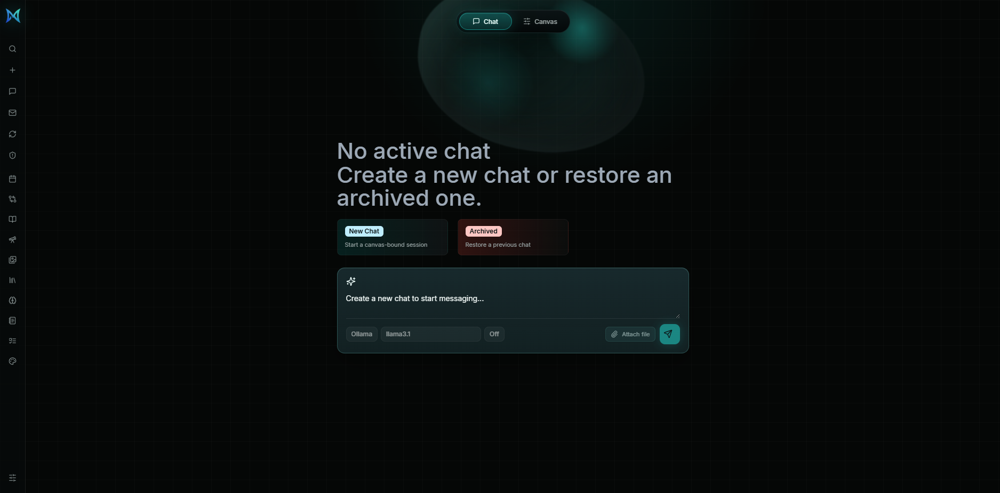

<p align="center">
  
</p>

# MetaNode OS Core | local AI workspace runtime

MetaNode OS is a private, local-first AI automation workspace. It gives you a ChatGPT/Claude-like chat surface, but binds it to a visual workflow canvas, local model providers, tools, credentials, approvals, runs, and agent assets that live under your control.

This repository is the private core bundle source that the public launcher downloads after approval. It contains the web app, API, worker package, workflow engine, provider registry, and release scripts.

## Features

- **Chat** -- talk to MetaNode OS directly or route a message into canvas orchestration.

  Ollama | OpenAI | Anthropic | per-session model selection | reasoning controls | direct/model mode

- **Canvas** -- build visual workflows with draggable nodes, dynamic handles, grouped nodes, run controls, and node inspection.

  React Flow | triggers | AI agents | channels | data tools | IT ops | storage | programming nodes

- **Agent orchestration** -- ask chat to create nodes, connect edges, update workflows, run flows, inspect failures, and explain canvas state.

  canvas tools | route detection | workflow summaries | approval-aware runs | session learning

- **Tools panel** -- a left-side Odysseus-style rail for workspace tools that open contextual panels.

  Search | Chats | Email | Calendar | Compare | Cookbook | Deep Research | Gallery | Library | Brain | Notes | Tasks | Theme

- **Chats** -- create, select, archive, restore, and delete canvas-bound chat sessions.

  active sessions | archived sessions | model metadata | workflow binding

- **Runs and approvals** -- inspect executions and approval gates without leaving the workspace.

  run history | retry flow | pending approvals | approve/reject decisions | audit context

- **Email assistant setup** -- prepare inbox triage and communication workflows.

  Gmail OAuth | Microsoft Graph | IMAP/SMTP | Teams webhook | draft routing | calendar/task/note planning

- **Agent assets** -- connect Soul, Skill, and Personality assets into AI Agent workflows.

  reusable instructions | skill bundles | profile handles | agent memory shape

- **Credentials** -- store integration references through the backend instead of hardcoding secrets into the UI.

  API keys | OAuth metadata | SSH/token/basic/custom credentials | scoped visibility

- **Private distribution** -- signed core assets are served to approved launchers through the distribution path.

  Cloudflare Worker approval | download token | signed manifest | private GitHub release assets

## Screenshots

### Workspace



## Quick Start

Defaults work locally after install. Start the API, worker, and web app together:

```powershell
npm.cmd install
npm.cmd run dev
```

Open:

```text
http://localhost:5173
```

Default local ports:

```text
Web UI  http://localhost:5173
API     http://localhost:4310
```

Configure providers, credentials, users, and workflow assets inside the app. Keep `.env.local` for local overrides and `.env.example` as the shared reference.

## Local Models

MetaNode OS can use Ollama for local chat and canvas orchestration.

```text
OLLAMA_HOST=http://localhost:11434
```

Install a model in Ollama, then select `ollama` and the model name in the composer.

```powershell
ollama pull llama3.1
ollama serve
```

4. The distribution API streams those private release assets to approved launchers. The launcher never receives a GitHub token.

## Security Notes

MetaNode OS is an automation console with chat, credentials, workflow execution, provider access, local model routing, and future mailbox/calendar integrations. Treat it like an admin tool.

- Keep `.env.local`, `data/`, local databases, release keys, provider keys, OAuth secrets, generated logs, and uploaded files out of Git.
- Use real authentication before exposing the API or web UI outside local development.
- Keep raw model/provider ports internal unless you intentionally expose them behind a trusted private access layer.
- Rotate any provider key, OAuth secret, or token that appears in a shared screenshot, chat, log, or demo.
- Review approvals before allowing workflows to send messages, write files, call external APIs, or run terminal actions.

## Configuration

Most setup happens inside the app. Use environment files for deployment-level defaults.

| Variable | Purpose |
| --- | --- |
| `VITE_API_URL` | Web app API endpoint override. |
| `AUTH_SECRET` | API token signing secret. |
| `DATABASE_URL` | Optional Postgres connection string. Without it, local file-backed state is used. |
| `BARYON_STATE_FILE` | Local memory-store state file path override. |
| `OLLAMA_BASE_URL` | Ollama endpoint for local models. |
| `OLLAMA_DEFAULT_MODEL` | Default Ollama model name. |
| `OPENAI_API_KEY` | Optional OpenAI provider key. |
| `ANTHROPIC_API_KEY` | Optional Anthropic provider key. |
| `METANODE_RELEASE_PRIVATE_KEY_PEM` | Release signing key used by the bundle workflow. |

## Architecture

```text
apps/
  web/       React + Vite workspace UI
  api/       Fastify API for auth, chat, workflows, runs, approvals, credentials
  worker/    Distribution/approval worker package
packages/
  core/      Workflow engine, nodes, providers, intelligence helpers
scripts/
  build-core-bundle.mjs
data/
  app-state.json and local runtime state (gitignored)
```

## Data

Local runtime data is stored under `data/` unless a database URL or state-file override is configured. That folder is intentionally ignored by Git because it can contain users, sessions, workflow state, credentials metadata, runs, approvals, and local development data.
